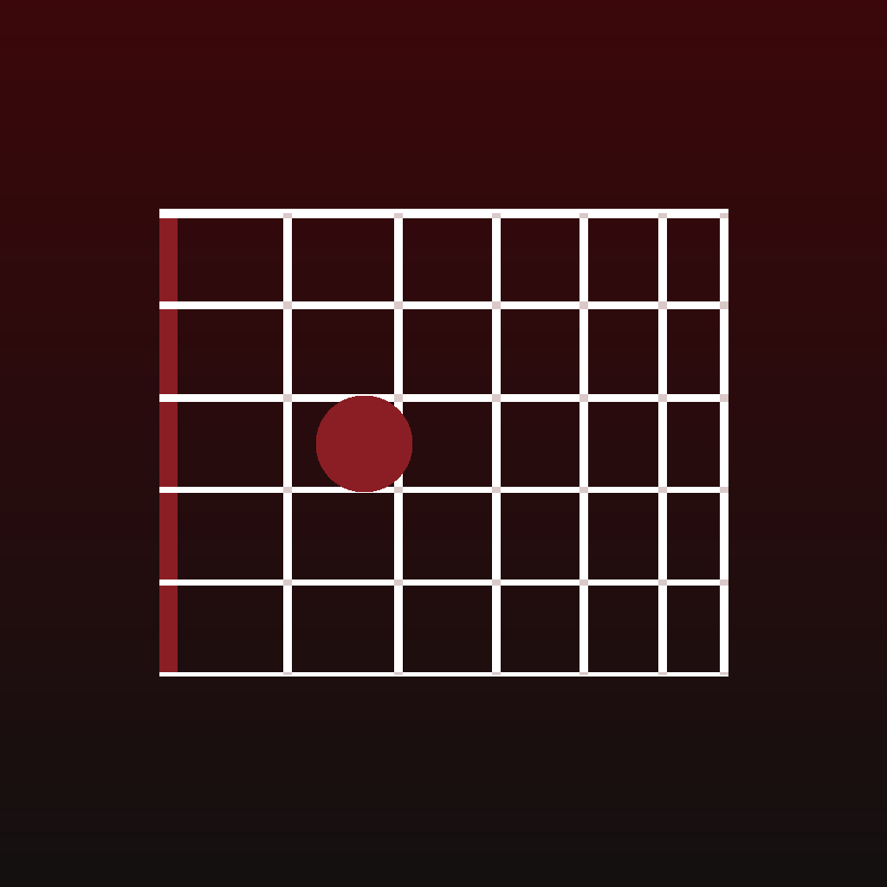

<div align="center">



# Fretwork

**An offline guitar practice companion that turns a technique curriculum into a
daily routine, a session timer, and an honest record of what you actually did.**

`Flutter 3.41` · `Dart 3.11` · `Android + iOS` · `316 tests` · `no network`

</div>

---

## What it does

You own a technique course. Fretwork schedules it.

Tell it how far through you are, and how long you can actually practise. It
builds a routine every day — weighted by where you are in the course, capped so
warm-up never eats the session, and rotated so nothing goes stale. Then it runs
that routine with a timer and a drift-free metronome, records every minute, and
turns the result into charts, a discipline score, and an exportable PDF.

It records the days you **don't** practise too. That is the point.

```
  Onboarding  →  Home  →  Session  →  History  →  Analytics  →  Advance
      ↑                                                             │
      └──────────── new part unlocked, routine rebalances ──────────┘
```

## The parts worth looking at

**A routine generator that argues with itself.** Category weights per milestone,
then caps: warm-up is capped as a *total* across all three warm-up categories,
free play and time feel individually, and anything that would fall under four
minutes is dropped and recorded as owed for tomorrow. Dropping is iterative —
removing one category lifts everyone else, which can rescue a second that was
only just under the floor — so a 20-minute session at the top milestone still
produces three real blocks instead of nine one-minute ones.

**A metronome that does not drift.** Every beat time is derived from its
absolute index, never by adding an interval to the previous beat. Accumulating
is what makes a metronome drift audibly inside a minute, because each addition
rounds and the rounding compounds. Worst-case error over two minutes at 200 bpm
is under 5 ms, and a test asserts the naive approach really does drift, so the
guarantee isn't vacuous.

**Tabs that never give up.** `CoreTabs` handles two variants and twenty-four
with the same component, switching *layout mode* rather than refusing to render.
It never wraps to a second row, never overlaps, never compresses a tab below its
density minimum, and never ellipsizes — 80 tests hold it to that across
320/390/430/768 dp, 2–24 items and three densities.

**Empty days are data.** Every day between launches gets a record, so the
calendar shows the days you missed instead of leaving them blank, and adherence
divides by the days you were meant to practise rather than the days you happened
to open the app.

**A score that tells you something.** Showing up is 80 % of it; getting faster
is 20 %, because speed arrives in plateaus and a score that punished flat months
would be lying. The card names your *weakest* term rather than congratulating
you — a score that only praises gives you nothing to act on.

## Design

Dark-first, sharp-cornered, glass over near-black. Three accent palettes.

Everything tappable inherits one press response: scale to 0.968 and dim 4 % over
90 ms, then spring back. It is driven from `Listener.onPointerDown` rather than
`GestureDetector.onTapDown`, because the tap recognizer withholds that callback
for up to 100 ms — and a tenth of a second of dead time before anything moves is
exactly what makes an app feel cheap.

Motion is physics or nothing. There are no scroll-triggered reveals; the only
entrance animations are a newly generated routine and newly unlocked content,
because those two are the only places where something genuinely *arrived*.
`Preferences.reduceMotion` collapses every duration to zero and haptics stay on.

## Privacy

No account. No network client. No analytics, no crash reporter, no ads. Every
byte lives on the device, and the only way data leaves is a PDF or a JSON backup
you explicitly asked for.

## Getting started

```bash
flutter pub get
flutter run

# regenerate the metronome clicks and the app icon
dart run tool/generate_clicks.dart
dart run tool/generate_icon.dart && dart run flutter_launcher_icons
```

```bash
flutter test          # 316 tests
dart analyze          # clean
flutter build apk --release
```

## Layout

```
lib/
  core/
    theme/      palette, type scale, spacing, glass surfaces
    motion/     duration and curve tokens, SpringCurve, page transitions
    widgets/    core_* — every widget the app is built from
    models/     immutable, hand-written toJson/fromJson, no codegen
    data/       document store, curriculum seed, providers
  features/
    onboarding/ four steps, with a live block-split preview
    home/       reorderable card stack
    routine/    the generator (pure) plus its screens
    session/    timer, metronome engine, records
    library/    exercise browser and detail
    history/    day rollover, backfill, calendar
    analytics/  metrics (pure), charts, discipline score, PDF export
    settings/   preferences, backup, reset
```

Rules that held: a feature may import `core/` and another feature's
`*_service.dart`, nothing else. Every model is hand-written — no `build_runner`,
no `freezed`, no generated providers. Pure logic (routine generation, analytics,
backfill, report prose) takes its clock and its data as parameters, so every
branch is reachable from a test without a running app.

## Content

Fretwork is a practice **tracker**, not a reproduction of any book. The
curriculum seed stores metadata only: exercise labels, technique tags, key and
position, tempo figures, procedure types, page and track pointers, and
descriptions written for this app. No notation, no tablature, no scans. Each
exercise shows a page reference and the book stays open next to the phone —
that is the intended workflow, not a limitation.

**The page and CD-track numbers in `course_seed.dart` are placeholders.** They
are sequential and plausible, not transcribed from a copy of the book. Correct
them against your own copy and bump `kSeedVersion` in `bootstrap.dart`.

## Known gaps

- **Tablet layout** is phone-first. Above 900 dp the Library and Analytics
  screens would benefit from a two-pane master/detail; they currently scale.
- **Notifications** are out of scope — a daily reminder would need
  `flutter_local_notifications`.
- **iOS is untested on device.** The project builds for it, but every run so far
  has been Android.
- **English only**, though all layout uses directional insets so an RTL locale
  can be added without rework.

## Licence

Personal project. The bundled Noto Sans is under the SIL Open Font License
(`assets/fonts/OFL.txt`).
